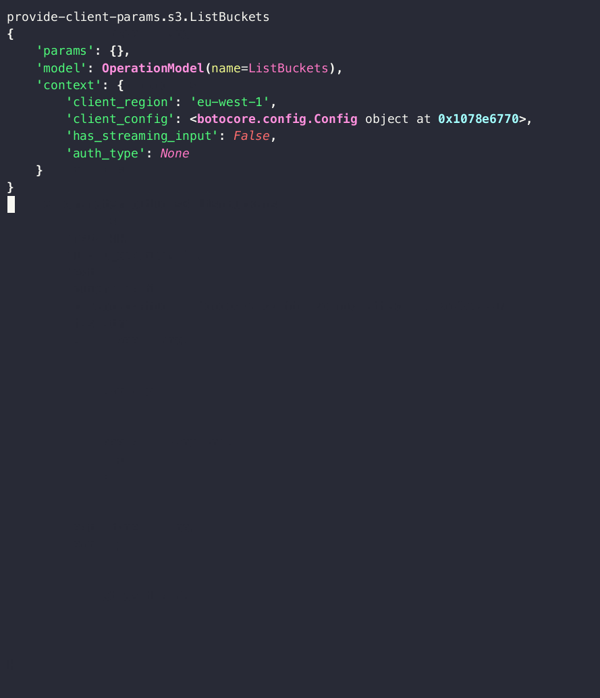
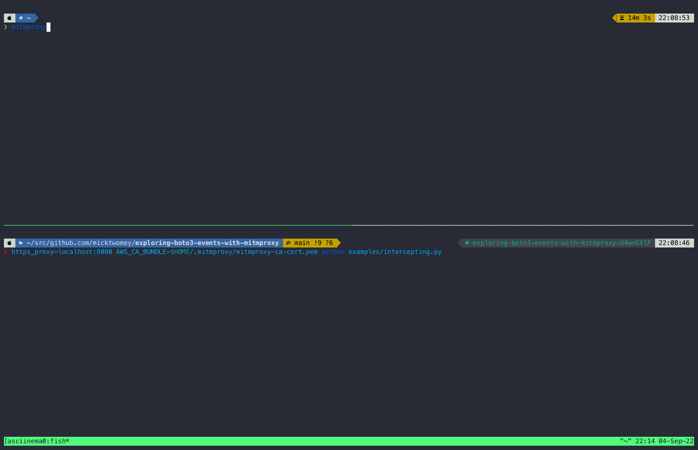

theme: fourTheorem, 1
slidenumbers: true

# [fit] Exploring Boto3 Events with MitmProxy

## AWS Community Summit, September 22 2022


Michael Twomey

@micktwomey / michael.twomey@fourtheorem.com


---

[.column]

# About Me

- ☁️ Senior Cloud Architect at fourTheorem
- Started my career in Sun Microsystems working on the Solaris OS in 1999 (when Y2K was a thing)
- 🐍 Been coding in Python for over 20 years
- Started kicking the tyres of AWS back when it was just S3, EC2 and SQS

[.column]


[https://fourtheorem.com/](https://fourtheorem.com/)

Reach out to us at [hello@fourTheorem.com](hello@fourTheorem.com) ✉️


^ We are a pioneering technology consultancy focused on aws and serverless

^ You might also know us from AWS Bites, a weekly podcast with Eoin and Luciano

---

# What I'll be Talking About

- Going to go through a problem from beginning to end
- I'll show what issues I ran into and how I solved them
- Will try to give just enough explanation of everything I use
- There are many ways to achieve what I wanted, this is just one path!

PS: I've a bunch of DALL-E credits to burn so expect silly images


---

# What I'll be Talking About

- A dash of AWS APIs
- Some boto3
- A bit of Python
- A pinch of HTTP
- A tiny bit of TLS
- A portion of mitmproxy


^ In short: how you combine tools to solve problems

^ Image: "London underground map" in the style of Indiana Jones

---

# The Setup


Code base using Python and the boto3 library to talk to AWS

The core of the system runs a huge amount of computations spread over a large amount of jobs in either Lambda or Fargate containers [^1]

It wouldn't be unusual to have thousands of containers running many compute jobs per second.

[^1]: For more details check out the post "A serverless architecture for high performance financial modelling" - [https://aws.amazon.com/blogs/hpc/a-serverless-architecture-for-high-performance-financial-modelling/](https://aws.amazon.com/blogs/hpc/a-serverless-architecture-for-high-performance-financial-modelling/)


---

# The Problem


During very large job runs we would occassionally see inexplicable slow downs and sometimes rate limit errors

This prompted the question:

> "Are we triggering a lot of S3 request retries?"

^ This could also equally apply to Kinesis or SQS or other APIs

---

# Request Retries?

AWS has rate limits on their APIs (sensible!)

S3 PUT object might have a rate limit of 3,500 requests per second [^2]

When you hit this you might get back a `HTTP 429` or `HTTP 503`

boto3 attempts to handle this invisibly via retries[^3] to minimize impact on your application

[^2]: [https://docs.aws.amazon.com/AmazonS3/latest/userguide/optimizing-performance.html](https://docs.aws.amazon.com/AmazonS3/latest/userguide/optimizing-performance.html)

[^3]: [https://boto3.amazonaws.com/v1/documentation/api/latest/guide/retries.html#standard-retry-mode](https://boto3.amazonaws.com/v1/documentation/api/latest/guide/retries.html#standard-retry-mode)

---

# Retry Mechanism

boto3's default retry handler[^4] implements the classic "retry with jitter" approach[^5]:

1. For a known set of errors catch them
2. Keep count of the number of times we've tried
3. If we've hit a maximum retry count fail and allow the error to bubble up
4. Otherwise take the count and multiply by some random number and some scale factor
5. Sleep for that long
6. Retry the call

[^4]: [https://github.com/boto/botocore/blob/develop/botocore/retryhandler.py](https://github.com/boto/botocore/blob/develop/botocore/retryhandler.py)

[^5]: [https://aws.amazon.com/builders-library/timeouts-retries-and-backoff-with-jitter/](https://aws.amazon.com/builders-library/timeouts-retries-and-backoff-with-jitter/)

---

# Retry Sleep Formula

```python
# From https://github.com/boto/botocore/blob/develop/botocore/retryhandler.py

base * (growth_factor ** (attempts - 1))

base = random.random()  # random float between 0.0 and 1.0
growth_factor = 2
attempts = 2
random.random() * (2 ** (2 - 1))
0.75 * 2 = 1.5

attempt 1 = 1 second max
attempt 2 = 2 second max
attempt 3 = 8 second max
attempt 4 = 16 second max
attempt 5 = 32 second max

# Default of 5 retries
32 + 16 + 8 + 2 + 1 = 59 seconds max sleep total, with 5x requests
```

---

# The Impact


Lots lots of calls per second * sleeping for a bunch of time = a big pile up

As more calls bunch up and sleep, we encounter more rate limits, leading to more calls...

Could this account for our stalls?

^ Image: "Big traffic jam" in the style of warner brothers cartoon

---

# How Can We Figure Out The Cause?

Could use logging at DEBUG level

```python
logging.basicConfig(level=logging.DEBUG)
```

This is super verbose and logs an overwhelming level of detail

What we want is some kind of hook to increment a count or emit a metric on retry

Does boto3 offer any hooks? 🤔


---

# boto3 Events

Events[^6] are an extension mechanism for boto3


[^6]: boto3 event docs over at [https://boto3.amazonaws.com/v1/documentation/api/latest/guide/events.html](https://boto3.amazonaws.com/v1/documentation/api/latest/guide/events.html)

---

# boto3 Events

[.column]
You register a function to be called when an event matching a pattern happens.

Wildcards (`*`) are also allowed for patterns.

```python
"provide-client-params.s3.ListObjects"
"provide-client-params.s3.*"
"provide-client-params.*"
"*"
```

[.column]
```python
def print_event(event_name, **kwargs):
    print(event_name)

s3 = boto3.client("s3")
s3.meta.events.register("needs-retry.*", print_event)
s3.list_buckets()

ec2 = boto3.client("ec2")
ec2.meta.events.register("needs-retry.*", print_event)
ec2.describe_instances()
```

---

```python
import boto3
from rich import print  # https://github.com/Textualize/rich


def print_event(event_name, **kwargs):
    print(event_name)

print("\nS3:")
s3 = boto3.client("s3")
s3.meta.events.register("*", print_event)
s3.list_buckets()

print("\nEC2:")
ec2 = boto3.client("ec2")
ec2.meta.events.register("*", print_event)
ec2.describe_instances()
```

---

```
S3:
provide-client-params.s3.ListBuckets
before-parameter-build.s3.ListBuckets
before-call.s3.ListBuckets
request-created.s3.ListBuckets
choose-signer.s3.ListBuckets
before-sign.s3.ListBuckets
before-send.s3.ListBuckets
response-received.s3.ListBuckets
needs-retry.s3.ListBuckets
after-call.s3.ListBuckets

EC2:
provide-client-params.ec2.DescribeInstances
before-parameter-build.ec2.DescribeInstances
before-call.ec2.DescribeInstances
request-created.ec2.DescribeInstances
choose-signer.ec2.DescribeInstances
before-sign.ec2.DescribeInstances
before-send.ec2.DescribeInstances
response-received.ec2.DescribeInstances
needs-retry.ec2.DescribeInstances
after-call.ec2.DescribeInstances
```

---

# boto3 Event Args

```python
import boto3
from rich import print

def print_event(event_name, **kwargs):
    print(event_name, kwargs)


s3 = boto3.client("s3")
s3.meta.events.register("*", print_event)

```

^ Python can capture keyword arguments (`foo="bar"`) into a variable using `**myvar`.


---




---

# Some Observations

[.column]

- That's a lot of different inputs for different events!
- The list of events isn't explicitly documented
- The args each event can receive isn't explicitly documented

=> It's hard to guess what code you'll need to implement without triggering the behaviour you want

[.column]

```python
provide-client-params.s3.ListBuckets
{
    'params': {},
    'model': OperationModel(name=ListBuckets),
    'context': {
        'client_region': 'eu-west-1',
        'client_config': <botocore.config.Config object at 0x1078b8d90>,
        'has_streaming_input': False,
        'auth_type': None
    }
}

request-created.s3.ListBuckets
{
    'request': <botocore.awsrequest.AWSRequest object at 0x1078bac20>,
    'operation_name': 'ListBuckets'
}

needs-retry.s3.ListBuckets
{
    'response': (
        <botocore.awsrequest.AWSResponse object at 0x107abb970>,
        {
            'ResponseMetadata': {
                'RequestId': 'QZV9EWHJMR4T8VQ9',
    ...
    'endpoint': s3(https://s3.eu-west-1.amazonaws.com),
    'operation': OperationModel(name=ListBuckets),
    'attempts': 1,
    'caught_exception': None,
    'request_dict': {
        'url_path': '/',
        'query_string': '',
        'method': 'GET',
    ...
}
```

---

# Side track: Extending Libraries in Python
## (Mick Complains About Lack of Autocomplete)

There are a few "classic" approaches to extending code in Python:

1. Inheritence
2. Callbacks
3. Events

---

# Inheritence

[.column]
```python
class MyLibrary:
  def do_something(self, arg1: int, arg2: float):
    ... library does something here ...

class MyModifiedLibrary(MyLibrary):
  def do_something(self, arg1: int, arg2: float):
    ... your stuff happens ...
    # call the original code too:
    super().do_something(arg1, arg2)
```

[.column]
- Works best with libraries written as a bunch of classes
- Can be very clunky and hard to predict how code will interact (hello mixins!)
- Usually needs explicit hooks for cleanly overriding functionality

---

# Callbacks

[.column]
```python
def add_handler(handler: Callable[[int, float], str]):
    pass

def my_handler(arg1: int, arg2: float) -> str:
    pass

def my_broken_handler(arg1: str, arg2: str) -> str:
    pass

add_handler(my_handler)

# error: Argument 1 to "add_handler"
# has incompatible type "Callable[[str, str], str]";
# expected "Callable[[int, float], str]"
add_handler(my_broken_handler)
```

[.column]
- Generally add_handler keeps a lis of functions to call somewhere
- This approach allows for typing hints to guide the developer
- Generally easy to document (code signatures do half the work)

---

# Events

[.column]
```python
def add_handler(event: str, handler: Callable):
    pass

def my_x_handler(arg1: int, arg2: float):
    pass

def my_y_handler(arg1: str):
    pass

add_handler("x.some_event", my_x_handler)
add_handler("y.rare_important_event", my_y_handler)

# This will probably break at runtime
add_handler("y.rare_important_event", my_x_handler)
```

[.column]
- Events usually used for generic hooks in libraries
- Having a consistent set of args for your handlers makes life easier
- Requires more documentation to guide the programmer

---

# boto3 Uses Events

Generic event hooks much easier to integrate to library, especially when dynamically generated like boto3

Drawback: can be very hard for the developer to know what events exist and how they behave

Solution: Lets watch them play out!

🤔 Now, how do we trigger rate limits?

---

# Triggering a rate limit

There are many ways to trigger rate limits:

- Hacking the library 📚
- Hacking Python 🐍
- Hacking the OS 👩‍💻
- Hacking the network 🌐
- Triggering the rate limit for real 💸

I chose to mess with the network 🌐

Why? This is close to what would be seen in real life and cheaper than calling for real!

---

# HTTP

We can mess with the HTTP responses boto3 gets

In particular:
- For a rate limit I'm betting boto3 looks at the HTTP response code
- I'm also betting it'll be HTTP 429
- I'm also betting the code doesn't care about the payload too much once it's a 429
- Finally I'm betting boto3 doesn't verify a response checksum

=> Lets change the response code!

---

[.column]

# From this

```javascript
HTTP/1.1 200 OK
Content-Length: 34202
Content-Type: application/json
...

{
  ...
}
```

[.column]

# To this

```javascript
HTTP/1.1 429 Rate limit exceeded
Content-Length: 34202
Content-Type: application/json;
...

{
  ...
}
```

---

# How do we achieve this?

One way to mess with HTTP is using a HTTP proxy

One tool which implements this is mitmproxy


---

# mitmproxy

https://mitmproxy.org

> mitmproxy is a free and open source interactive HTTPS proxy.

What?

Let's you mess with the HTTP requests and responses from programs

Bit like Chrome Dev Tools for all your HTTP speaking commands


---

# Basic usage

[.column]
1. Run `mitmproxy` (or `mitmweb` for a fancier web interface)
2. Set the HTTP proxy settings to mitmproxy's (defaults to http://localhost:8080)
3. Run your program
4. Watch in mitmproxy

Easy right?

[.column]
```sh
export http_proxy=localhost:8080
export https_proxy=localhost:8080

python my_app.py
```

---


---

# curl

```
❯ https_proxy=localhost:8080 curl -I https://www.fourtheorem.com
curl: (60) SSL certificate problem: unable to get local issuer certificate
More details here: https://curl.se/docs/sslcerts.html

curl failed to verify the legitimacy of the server and therefore could not
establish a secure connection to it. To learn more about this situation and
how to fix it, please visit the web page mentioned above.
```

Not so easy after all!

---

# Normal Working TLS


^ Trust store can be a full fledged service or a system folder of certificates.

---

# Our Broken TLS


---

# What's Going Wrong?


What's happening?

1. We tell curl to connect via mitmproxy to www.fourtheorem.com using HTTPS
2. curl connects to mitmproxy and tries to verify the TLS certificate
3. curl decides the certificate in the proxy isn't to be trusted and rejects the connection

---

# MITM

curl (and TLS) is doing its job: preventing someone from injecting themselves into the HTTP connection and intercepting traffic.

A man in the middle attack (or MITM) was prevented!

Unfortunately that's what we want to do!

---

# mitmproxy has an answer

Luckily mitmproxy generates TLS certificates for you to use:

```sh
❯ ls -l ~/.mitmproxy/
total 48
-rw-r--r--  1 mick  staff  1172 Sep  4 19:26 mitmproxy-ca-cert.cer
-rw-r--r--  1 mick  staff  1035 Sep  4 19:26 mitmproxy-ca-cert.p12
-rw-r--r--  1 mick  staff  1172 Sep  4 19:26 mitmproxy-ca-cert.pem
-rw-------  1 mick  staff  2411 Sep  4 19:26 mitmproxy-ca.p12
-rw-------  1 mick  staff  2847 Sep  4 19:26 mitmproxy-ca.pem
-rw-r--r--  1 mick  staff   770 Sep  4 19:26 mitmproxy-dhparam.pem
```

If you can somehow tell your command to trust these it will talk via mitmproxy!

---

# ⚠️ Danger! ⚠️ Here be Dragons! 🐉

To work mitmproxy requires clients to trust these certificates

This potentially opens up a massive security hole on your machine depending how this is set up

Recommendation: if possible restrict to one off command line invocations rather than install system wide

Luckily we can override on a per invocation basis in curl and boto3

Full guide: https://docs.mitmproxy.org/stable/concepts-certificates/

---

# Overriding the cert bundle

curl offers a simple way to trust a cert: `--cacert`

```sh
❯ https_proxy=localhost:8080 curl --cacert ~/.mitmproxy/mitmproxy-ca-cert.pem -I https://www.fourtheorem.com
HTTP/1.1 200 Connection established

HTTP/1.1 200 OK
Server: openresty
Date: Sun, 04 Sep 2022 20:09:03 GMT
Content-Type: text/html; charset=utf-8
Content-Length: 520810
Connection: keep-alive
...
```

---

# Working mitmproxy


---

```
* Uses proxy env variable https_proxy == 'localhost:8080'
*   Trying 127.0.0.1:8080...
* Connected to localhost (127.0.0.1) port 8080 (#0)
* allocate connect buffer!
* Establish HTTP proxy tunnel to www.google.ie:443
...
* Proxy replied 200 to CONNECT request
...
* successfully set certificate verify locations:
*  CAfile: /Users/mick/.mitmproxy/mitmproxy-ca-cert.pem
*  CApath: none
* (304) (OUT), TLS handshake, Client hello (1):
* (304) (IN), TLS handshake, Server hello (2):
* (304) (IN), TLS handshake, Unknown (8):
* (304) (IN), TLS handshake, Certificate (11):
* (304) (IN), TLS handshake, CERT verify (15):
* (304) (IN), TLS handshake, Finished (20):
* (304) (OUT), TLS handshake, Finished (20):
* SSL connection using TLSv1.3 / AEAD-AES256-GCM-SHA384
* ALPN, server accepted to use h2
* Server certificate:
*  subject: CN=*.google.ie
*  start date: Sep 17 11:58:59 2022 GMT
*  expire date: Sep 19 11:58:59 2023 GMT
*  subjectAltName: host "www.google.ie" matched cert's "*.google.ie"
*  issuer: CN=mitmproxy; O=mitmproxy
*  SSL certificate verify ok.
...
```

---


---

# boto3

We can do something similar with boto3:

```sh
❯ https_proxy=localhost:8080 \
  AWS_CA_BUNDLE=$HOME/.mitmproxy/mitmproxy-ca-cert.pem \
  python examples/print_events.py

S3:
provide-client-params.s3.ListBuckets
before-parameter-build.s3.ListBuckets
before-call.s3.ListBuckets
request-created.s3.ListBuckets
...
```

We tell boto3 to use a different cert bundle (`AWS_CA_BUNDLE`)

---


---

# What Were We Trying to Do Again?

We can now:
1. Run some requests from boto3 to AWS
2. Intercept and inspect these requests in mitmproxy

How does this help us?


---

# More than a HTTP debugger

mitmproxy offers the ability to intercept and change HTTP requests
- [https://docs.mitmproxy.org/stable/mitmproxytutorial-interceptrequests/](https://docs.mitmproxy.org/stable/mitmproxytutorial-interceptrequests/)
- [https://docs.mitmproxy.org/stable/mitmproxytutorial-modifyrequests/](https://docs.mitmproxy.org/stable/mitmproxytutorial-modifyrequests/)

^ It also offers a full API and the ability to replay requests

---

# Intercepting

1. Hit `i` to create an intercept
2. `~d s3.eu-west-1.amazonaws.com & ~s`
3. Run the command
4. In the UI go into the response and hit `e`
5. Change the response code to 429
6. Hit `a` to allow the request to continue
7. Watch what happens in the command

---

Modified code to focus on retry mechanism for brevity

```python
import boto3
from rich import print
import time


def print_event(event_name: str, attempts: int, operation, response, request_dict, **_):
    print(
        event_name,
        operation,
        attempts,
        response[1]["ResponseMetadata"]["HTTPStatusCode"],
        request_dict["context"]["retries"],
    )


s3 = boto3.client("s3")
s3.meta.events.register("needs-retry.s3.ListBuckets", print_event)
s3.list_buckets()
```

---



---

```python
❯ https_proxy=localhost:8080 \
  AWS_CA_BUNDLE=$HOME/.mitmproxy/mitmproxy-ca-cert.pem \
  python examples/intercepting.py

needs-retry.s3.ListBuckets OperationModel(name=ListBuckets) 1 429
{'attempt': 1, 'invocation-id': '...'}
needs-retry.s3.ListBuckets OperationModel(name=ListBuckets) 2 429
{'attempt': 2, 'invocation-id': '...', 'max': 5, 'ttl': '20220904T211601Z'}
needs-retry.s3.ListBuckets OperationModel(name=ListBuckets) 3 200
{'attempt': 3, 'invocation-id': '...', 'max': 5, 'ttl': '20220904T211623Z'}
```

Observations:
1. The retry counter starts at 1
2. It increments every time there's a retried call
3. Can test for `attempt > 1`

---

Finally! Can emit metrics!

```python
import boto3
from rich import print


def increment_metric(name):
    print(f"{name}|increment|count=1")


def handle_retry(event_name: str, attempts: int, **_):
    if attempts > 1:
        increment_metric(event_name)


s3 = boto3.client("s3")
s3.meta.events.register("needs-retry.s3.*", handle_retry)
s3.list_buckets()
print("All done!")
```

---


---

# So What Was the Point of All That?


```bash
fields @timestamp, event_name
| filter ispresent(event_name)
| filter event_name	= 'needs-retry.s3.PutObject'
| filter attempts > 1
| sort by @timestamp asc
| stats count() by bin(1m)
```

The graph shows over 250K retry attempts at the peak!

It also shows some kind of oscillation, possibly due to so many connections sleeping at the same time.

^Each horizontal tick mark is a minute

---

# What We Covered

- AWS API limits
  - [https://docs.aws.amazon.com/AmazonS3/latest/userguide/optimizing-performance.html](https://docs.aws.amazon.com/AmazonS3/latest/userguide/optimizing-performance.html)
- boto3's event system
  - [https://boto3.amazonaws.com/v1/documentation/api/latest/guide/events.html](https://boto3.amazonaws.com/v1/documentation/api/latest/guide/events.html)
- How request retries behave
  - [https://boto3.amazonaws.com/v1/documentation/api/latest/guide/retries.html#standard-retry-mode](https://boto3.amazonaws.com/v1/documentation/api/latest/guide/retries.html#standard-retry-mode)
- mitmproxy
  - [https://mitmproxy.org](https://mitmproxy.org)

---

# Thank You! 🎉

[.column]


- ✉️ michael.twomey@fourtheorem.com
- 🐤 [https://twitter.com/micktwomey](https://twitter.com/micktwomey)
- 🧑🏽‍💼 [https://fourtheorem.com/](https://fourtheorem.com/)
  - [https://twitter.com/fourtheorem](https://twitter.com/fourtheorem)


[.column]


Slides & Code: [https://github.com/micktwomey/exploring-boto3-events-with-mitmproxy](https://github.com/micktwomey/exploring-boto3-events-with-mitmproxy)
